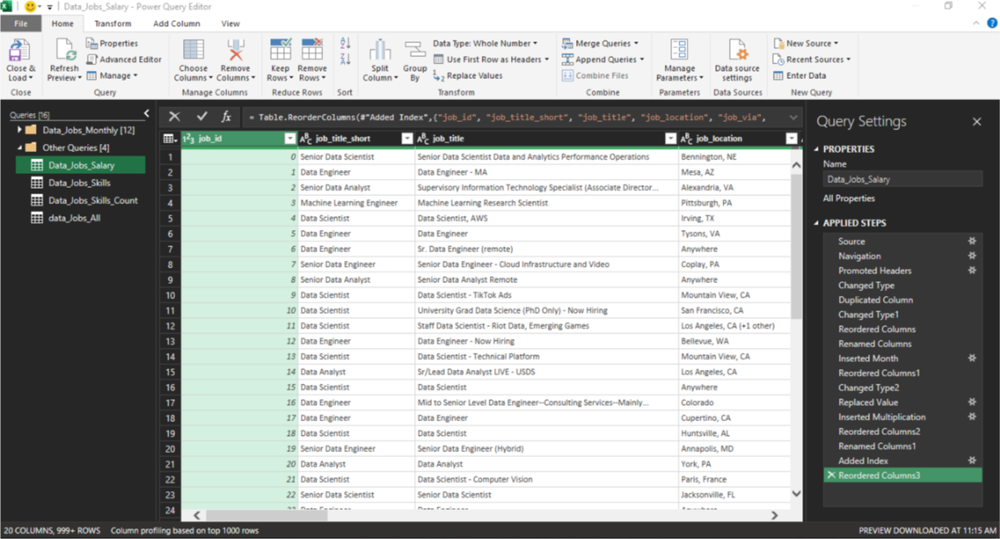
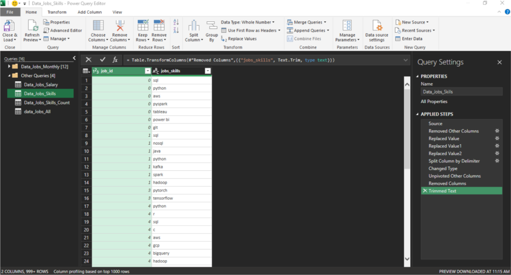

# Decoding-the-Data-Job-Market
As a job seeker, I’ve always been surprised by the lack of data exploring the most optimal jobs and skills in the data science market. I set out to understand what skills top employers request and how to secure a higher salary.

### Questions to Analyze
To understand the data science job market, I asked the following:

- Do more skills get you better pay?
- What’s the salary for data jobs in different regions?
- What are the top skills of data professionals?
- What’s the pay for the top 10 skills?

  ### Excel Skills Used

  The following Excel skills were utilized for analysis:

- 📊 Pivot Tables
- 📈 Pivot Charts
- 🧮 DAX (Data Analysis Expressions)
- 🔍 Power Query
- 💪 Power Pivot

  ### Data Jobs Dataset
  
The dataset used for this project contains real-world data science job information from 2023. The dataset is available via my Excel course, which provides a foundation for analyzing data using Excel.

It includes detailed information on:

- 👨‍💼 Job titles
- 💰 Salaries
- 📍 Locations
- 🛠️ Skills

 ## Do more skills get you better pay?
 
### 🔍 Skill: Power Query (ETL)

📥 Extract

I first used Power Query to extract the original data (data_salary_all.xlsx) and create two queries:
- 🗃️ First one with all the data jobs information.
- 🔧 The second listing shows the skills for each job ID.
🔄 Transform

Then, I transformed each query by changing column types, removing unnecessary columns, cleaning text to eliminate specific words, and trimming excess whitespace.

🔗 Load

Finally, I loaded both transformed queries into the workbook, setting the foundation for my subsequent analysis.

- 📊 data_jobs_salary

- 🛠️ data_job_skills

  

