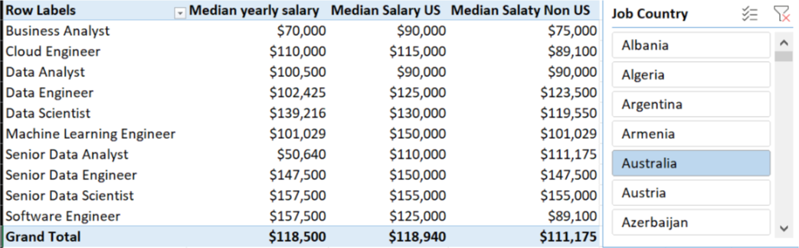

# Decoding-the-Data-Job-Market
As a job seeker, I’ve always been surprised by the lack of data exploring the most optimal jobs and skills in the data science market. I set out to understand what skills top employers request and how to secure a higher salary.

### Questions to Analyze
To understand the data science job market, I asked the following:

- Do more skills get you better pay?
- What’s the salary for data jobs in different regions?
- What are the top skills of data professionals?
- What’s the pay for the top 10 skills?

  ### Excel Skills Used

  The following Excel skills were utilized for analysis:

- 📊 Pivot Tables
- 📈 Pivot Charts
- 🧮 DAX (Data Analysis Expressions)
- 🔍 Power Query
- 💪 Power Pivot

  ### Data Jobs Dataset
  
The dataset used for this project contains real-world data science job information from 2023. The dataset is available via my Excel course, which provides a foundation for analyzing data using Excel.

It includes detailed information on:

- 👨‍💼 Job titles
- 💰 Salaries
- 📍 Locations
- 🛠️ Skills

 ## 1. Do more skills get you better pay?
 
### 🔍 Skill: Power Query (ETL)

📥 Extract

I first used Power Query to extract the original data (data_salary_all.xlsx) and create two queries:
- 🗃️ First one with all the data jobs information.
- 🔧 The second listing shows the skills for each job ID.
🔄 Transform

Then, I transformed each query by changing column types, removing unnecessary columns, cleaning text to eliminate specific words, and trimming excess whitespace.

🔗 Load

Finally, I loaded both transformed queries into the workbook, setting the foundation for my subsequent analysis.

- 📊 data_jobs_salary

  

- 🛠️ data_job_skills

  

📊 Analysis

  💡 Insights
    - 📈 There is a positive correlation between the number of skills requested in job postings and the median salary, particularly in roles like Senior Data Engineer and Data Scientist.
    - Roles that require fewer skills, like Business Analyst, tend to offer lower salaries, suggesting that more specialized skill sets command higher market value.
    
    
  🤔 So What
    - This trend emphasizes the value of acquiring multiple relevant skills, particularly for individuals aiming for higher-paying roles.

## 2. What’s the salary for data jobs in different regions?

### 🧮 Skills: PivotTables & DAX

📈Pivot Table

  - 🔢 I created a PivotTable using the Data Model I created with Power Pivot.
  - 📊 I moved the job_title_short to the rows area and salary_year_avg to the values area.
  - 🧮 Then I added a new measure to calculate the median salary for United States jobs

    =CALCULATE(
    MEDIAN(data_jobs_all[salary_year_avg]),
    data_jobs_all[job_country] = "United States")

🧮 DAX

To calculate the median year salary, I used DAX.

  Median Salary := MEDIAN(data_jobs_all[salary_year_avg])

📊 Analysis

  💡 Insights
  
  - 💼 Job roles like Senior Data Engineer and Data Scientist command higher median salaries both in the US and internationally, showcasing the global demand for high-level data expertise.

  - 💰 The salary disparity between US and Non-US roles is particularly notable in high-tech jobs, which might be influenced by the concentration of tech industries in the US.

  

    

